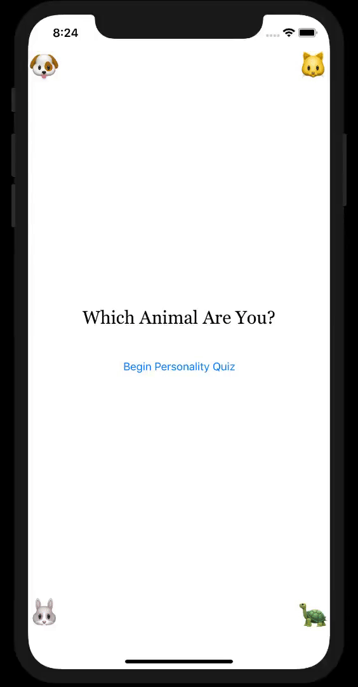

# PersonalityQuiz

### Personality Quiz App from iBooks

###### For this project, I create a personality quiz. Maybe you've seen this type of game before. Players are presented with a light-hearted topic and answer questions that align them to a particular outcome. Here are some examples of personality quiz topics:

+ Which food do you like the most?
+ Which activities do you enjoy?
+ How much do you enjoy car rides?

###### I used three view controllers for this quiz:

+ The first is an introduction screen with information about the quiz and a button to begin.
+ The second view controller displays a question and several answers, and manages the responses. This view controller is refreshed for each question, and depending on what kind of question you ask, the right controls will be displayed.
+ The third view controller tallies up the answers and presents the final outcome. This result can be dismissed, allowing another player to start the quiz from the first view controller.

###### I used the following to make this app:

+ `buttons` for the choices of the player. 
+ `labels` that displays the questions and several answers.
+ `switches` so the player can switch on all positive answers.
+ `slider` to allow the player a range of answers, and giving him more freedom.

---
